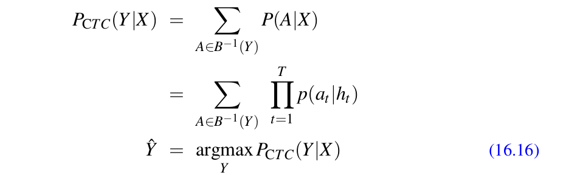
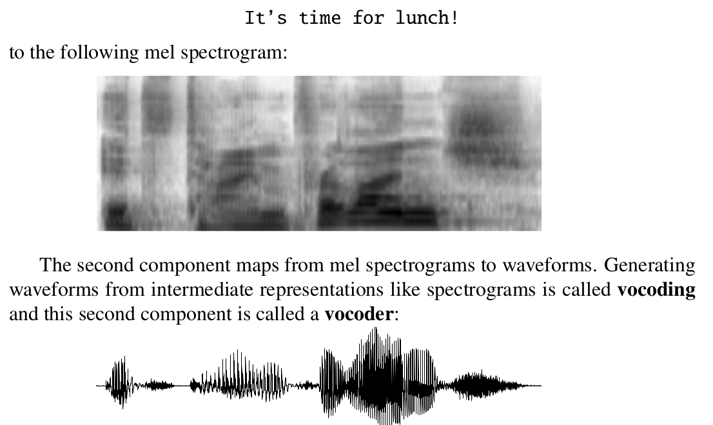
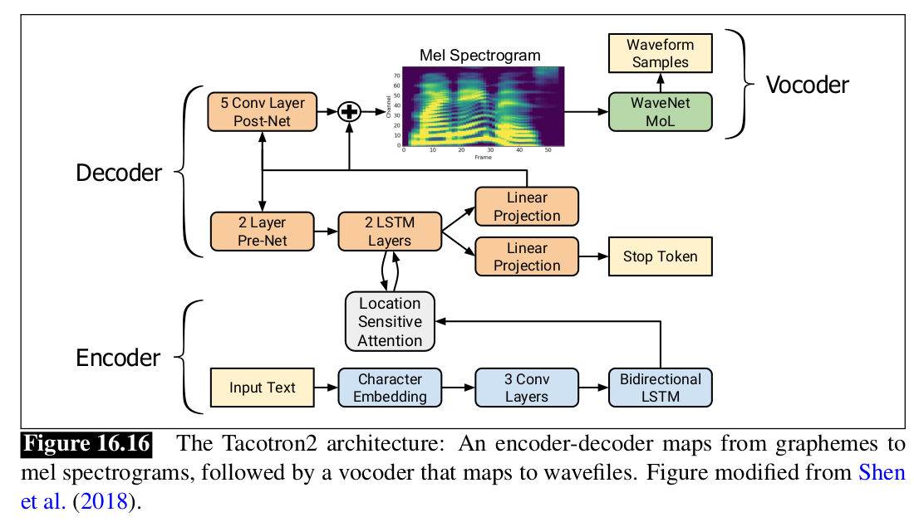
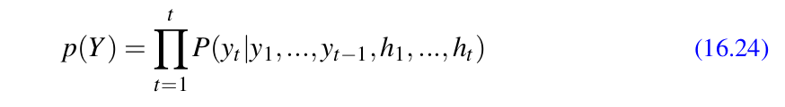
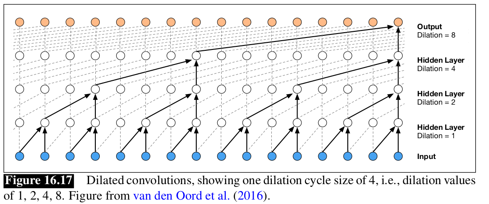
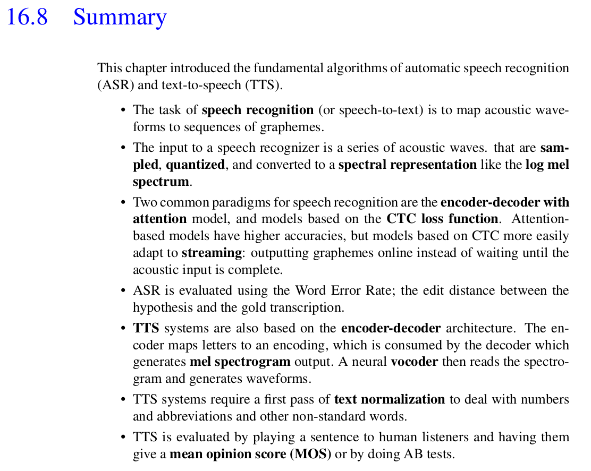

# Automatic Speech Recognition and Text-to-Speech

> These are my personal study notes on ``Chapter 16`` of the book ``“Speech and Language Processing” authored by Daniel Jurafsky & James H. Martin``. The notes were compiled by me, Ahmed Haytham. As a learner, I acknowledge that there may be inadvertent errors in these notes. If you come across any inaccuracies, I would appreciate your feedback to correct them.
---
# Table of Contents
- [Introduction](#Introduction)
- [Automatic Speech Recognition `ASR`](#Automatic-Speech-Recognition-`ASR`)
- [Text-to-Speech `TTS`](#Text-to-Speech-`TTS`)
- [Conclusion](#Conclusion)
---
# Introduction 

## Automatic Speech Recognition `ASR`
- **Automatic Speech Recognition** is to map any waveform like this: 
To a sequence of words like this: <big>`It’s time for lunch!`</big>

## Text-to-Speech `TTS`
- **Text-to-Speech** is to map a sequence of words like this: <h3>`It’s time for lunch!`</h3>
To a waveform like this: 
---
# Automatic Speech Recognition `ASR`

Automatic Speech Recognition (ASR) systems face challenges based on various factors. These factors can be categorized into `4` key dimensions:

1. **Vocabulary Size:** Larger vocabularies pose greater difficulty.
    - ASR tasks vary based on the size of the vocabulary involved.
    - Tasks with smaller vocabularies, like `yes/no` recognition or digit recognition, are easier.
    - Open-ended tasks with larger vocabularies, such as transcribing conversations with up to `60,000 words`, pose greater challenges.

2. **Speaking Style / Type:** Machine-directed or read speech is easier than conversation.
    - Speech directed towards machines (dictation or dialogue systems) is easier to recognize than human-to-human conversations.
    - Read speech (e.g., audio books) is also relatively easy to recognize.
    - Conversational speech, such as **``transcribing business meetings, presents the greatest challenge.``**
    - Simplification of speech occurs when humans talk to machines or read without an audience, resulting in slower and clearer speech.

3. **Channel and Noise:** Quiet environments with close microphones are ideal.
    - Recognition is influenced by the recording environment, with quiet rooms and head-mounted microphones yielding better results than noisy environments or distant microphones.

4. **Accent and Speaker Characteristics:** Matching speaker dialect/age to training data improves accuracy.
    - Recognition is more accurate when speakers use the same dialect or variety as the training data.
    - Regional, ethnic dialects, or speech by children may pose challenges if the system is trained only on standard dialects or adult speakers.

## Feature Extraction for ASR: Log Mel Spectrum
- **Feature extraction** is the process of converting raw audio into a feature representation that can be used for recognition.

### 1. Sampling and Quantization
1. **Input to Speech Recognizer:** The input to a speech recognizer consists of changes in air pressure over time, which originate from the speaker's vocal apparatus (glottis, oral, or nasal cavities).

2. **Representation of Sound Waves:** Sound waves are represented by plotting the change in air pressure over time. This can be visualized as a graph measuring compression or rarefaction of air molecules.

    - **Example: Figure 16.2  ** `A waveform of an instance of the vowel [iy] (the last vowel in the word “baby”). The y-axis
shows the level of air pressure above and below normal atmospheric pressure. The x-axis shows time. Notice
that the wave repeats regularly.`

3. **Analog-to-Digital Conversion:** Converting analog representations of sound waves (air pressure and electric signals in a microphone) into digital signals involves two steps: ``sampling`` and ``quantization``.
    - 3.1.  **Sampling:** Sampling involves measuring the amplitude of the signal at specific times. **``The sampling rate``** determines the number of samples taken per second.
        - **Sampling Requirements:** To accurately measure a wave, at least ``2 samples`` are needed per ``cycle`` one for the ``positive part`` and one for the ``negative part``. Having more than two samples per cycle increases ``amplitude accuracy``, while fewer than two samples cause the frequency of the wave to be missed.
        - **Maximum Frequency Measurement:** The maximum frequency wave that can be accurately measured is one whose frequency is half the sample rate, as each cycle requires two samples.
        - **Impact on Automatic Speech Recognition (ASR):** Higher sampling rates generally lead to higher ASR accuracy.
        - **Downsampling for Consistency:** When training on multiple corpora, if one includes telephone speech, it's necessary to downsample all wideband corpora to 8 KHz to maintain consistency.
    - 3.2 **Quantization:** Quantization involves representing ``real-valued numbers as integers``. Values closer together than the minimum granularity are represented identically.
        - **Amplitude Measurement:** When we measure the strength of sound waves, we store these measurements as integers. These integers can be either ``8-bit (ranging from -128 to 127)`` or ``16-bit (ranging from -32768 to 32767).``
        - **Storage Formats:** Quantized data is stored in various formats with different parameters:
            - **Sample rate and sample size:** Telephone speech is often sampled at 8 kHz and stored as ``8-bit`` samples, while microphone data is often sampled at ``16 kHz`` and stored as 16-bit samples.
            - **Number of channels:** Stereo data or two-party conversations can be stored in the same file or separate files.
            - **Individual sample storage:** Samples can be stored ``linearly`` or ``compressed``.
    - 3.3 **Compression Formats:** 
        - One common compression format for telephone speech is ``µ-law``, pronounced as ``"mu-law"`` ميو لو 
            - µ-law compression is based on the intuition that human hearing is more sensitive to small intensity changes than large ones.
            - The compression algorithm faithfully represents small values while introducing more error for large values.  
     
    - 3.4 **Standard File Formats for Storing Digitized Waveforms:** Various standard file formats are used for storing digitized waveforms, including ``Microsoft's .wav`` and ``Apple's AIFF`` formats. These formats typically include special headers to provide essential information about the data.
    - Types of File Formats:
        - `.wav Format:` This format is a subset of Microsoft's RIFF (Resource Interchange File Format) for multimedia files. RIFF is a versatile format capable of representing nested chunks of data and control information
    - **Headers in File Formats:** Headers in these file formats contain important metadata and structural information about the stored waveform data.
    - Example: Figure 16.3 
     
-- End of  1. Sampling and Quantization --
### 2. Windowing:
- **2.1 Objective:**
    - Extract ``spectral features`` from a small window of speech that characterizes part of a specific phoneme.
    - The goal is to capture stationary portions of speech within this window.

- **2.2 Windowing Process:**
    - Use a **window function** to extract a portion of the speech signal.
    - The window is non-zero within a specific region and zero elsewhere.
    - Multiply the input waveform by the window function to produce a windowed waveform.

- **2.3 Frame Extraction:**
    - The speech extracted from each window is called a frame.
    - Parameters for windowing:
        - **Window size (frame size)** determines the width of the window in milliseconds.
        - **Frame stride** (shift or offset) specifies the gap between successive windows.
        - **Window shape:** The example given uses a **rectangular** window. 
 

``In summary, the windowing process allows us to focus on specific parts of the speech signal by using a window function, which highlights the desired segment while suppressing the rest. The resulting windowed waveform captures relevant information for further analysis. 😊``
- **2.4 Windowing Process and Discontinuities:**
    - When applying windowing to a signal, it abruptly cuts off the signal at its boundaries.
    - This abrupt cutoff creates problems when performing **Fourier analysis.**
    - The issue arises because the discontinuity at the window boundaries introduces unwanted artifacts in the frequency domain.
    - To mitigate these discontinuities, we commonly use the **Hamming window** for acoustic feature creation.

- **2.5 Hamming Window:**
    - The Hamming window smoothly **shrinks** the values of the signal toward zero at the window boundaries.
    - The Hamming window smoothly **shrinks** the values of the signal toward zero at the window boundaries. 
     

    ``In summary, the Hamming window is preferred over the rectangular window because it smoothly tapers the signal toward zero at the window boundaries, reducing discontinuities and improving the quality of spectral analysis. ``

-- End of 2. Windowing --
### 3. Discrete Fourier Transform:
- **3.1 Objective:**
    - The goal is to extract spectral information from our windowed signal.
    - We want to understand **how much energy** the signal contains at different frequency bands.
- **3.2 DFT Overview:**
    - **The Discrete Fourier Transform (DFT)** is used for converting a **finite sequence of equally-spaced samples of a function** into **a same-length sequence** of equally-spaced samples of the discrete-time Fourier transform (DTFT). the DTFT is a complex-valued function of frequency
- **3.3 Mathematical Details:**
    - The DFT takes a windowed signal (x[n]…x[m]) as input.
    - For each of (N) discrete frequency bands, it produces a complex number (X[k]) representing the magnitude and phase of that frequency component in the original signal.
    - The DFT allows us to visualize the spectrum of the signal by plotting magnitude against frequency.  
- **3.4 Eurler's Formula:**
    - Fourier analysis relies on Euler’s formula:  
    \[ e^{j\theta} = \cos(\theta) + j\sin(\theta) \]

- **3.5 DFT Formula:**
    - The DFT formula is given by:
    \[ X[k] = \sum_{n=0}^{N-1} x[n]e^{-j2\pi kn/N} \]

- **3.6 Fast Fourier Transform (FFT):**
    - The FFT is a highly efficient algorithm for computing the DFT.
    - It factorizes the DFT matrix into a product of sparse factors, significantly reducing computation time.

``In summary, the DFT allows us to analyze the frequency content of a signal, and the FFT is a fast algorithm for computing the DFT efficiently. 😊``

-- End of 3. Discrete Fourier Transform --

### 4. Mel Filterbank and Log:
- **4.1 Objective:**
    - The goal is to improve speech recognition performance by **modeling human perceptual sensitivity** to different frequency bands.
    - Human hearing is **less** sensitive at **higher** frequencies, and this bias toward low frequencies aids in recognizing speech sounds.
- **4.2 Mel Scale:**
    - We collect energies from each frequency band according to the **mel scale**, an auditory frequency scale.
    - The mel scale ensures that perceptually equidistant sounds (in terms of pitch) are separated by an equal number of mels.
    - The mel frequency (m) can be computed from the raw acoustic frequency (f) using a logarithmic transformation:
    \[ \text{mel}(f) = 1127 \ln\left(1 + \frac{f}{700}\right) \]
- **4.3 Creating the Mel Filter Bank:**
    - We create a bank of filters that collect energy from each frequency band.
    - These filters are spread logarithmically to provide fine resolution at low frequencies and less resolution at high frequencies.
    - Figure 16.7 illustrates a sample bank of triangular filters that implement this idea.
       
    - These filters can be multiplied by the spectrum to obtain a mel spectrum.
- **4.4 Taking the Log:**
    - Finally, we take the **logarithm** of each mel spectrum value.
    - The human response to signal level is also logarithmic (similar to the human response to frequency).
    - Using a log makes the feature estimates less sensitive to variations in input, such as power variations due to the speaker’s mouth moving closer or further from the microphone.

``In summary, the Mel Filter Bank and the log transformation help improve speech recognition by accounting for human perceptual sensitivity to different frequency components. 😊``

-- End of 4. Mel Filterbank and Log --
-- End of Feature Extraction for ASR: Log Mel Spectrum --

---
# Speech Recognition Architecture:

- ## 1. Encoder-Decoder Architecture:
    - The basic architecture for **Automatic Speech Recognition (ASR)** is the encoder-decoder model.
    - This architecture is similar to what was introduced for **Machine Translation (MT)** it can be RNNs or transformers.
    - We start with **log mel spectral features** (discussed in the previous section) and map them to letters (or other linguistic units).
    - The **encoder** processes the input sequence (acoustic feature vectors), and the **decoder** generates the output sequence (letters or word pieces).

    - ### 2.1. Attention-Based Encoder-Decoder (AED):
        - The standard encoder-decoder architecture is commonly referred to as the **attention-based encoder-decoder or AED**.
        - It is also known as **listen, attend, and spell (LAS)**.
        - The input consists of a sequence of acoustic feature vectors (F = f_1, f_2, …, f_t), where each vector - corresponds to a `X` ms frame.
        - The output sequence (Y) can be letters or word pieces.
        - Special tokens like start of sequence (SOS) and end of sequence (EOS) are used.
        - For English, the set of possible output characters might include letters, digits, spaces, commas, periods, apostrophes, and unknown tokens. 
         

    - ### 3.1 Handling Length Differences:
        - Encoder-decoder architectures are particularly appropriate when input and output sequences have ***stark*** length differences.
        - In speech recognition, acoustic feature sequences are **much longer** than the corresponding letter or word sequences.
        - To address this, encoder-decoder architectures for speech include a special compression stage that shortens the acoustic feature sequence before the encoder stage.
        - Alternatively, a loss function like the **CTC loss function** can handle compression effectively.

        ``In summary,The encoder maps input sequences (e.g., speech features) to continuous representations. The decoder unfolds these representations to generate meaningful output sequences (e.g., transcriptions). the encoder-decoder architecture, attention mechanisms, and handling of length differences are crucial for building effective speech recognition systems. the encoder be like understanding the input and tech the decoder what he understand to make the encoder generate the output. 😊`` 

    - ### 4.1 Subsampling Goal:
        - The goal of subsampling is to reduce the length of the input sequence.
        - The goal of subsampling is to create a shorter sequence, denoted as X = x1, …, xn, which will serve as input to the encoder.**while retaining relevant information.**
           
            - **Low Frame Rate Algorithm: LFR**
                - A simple method for subsampling is called “low frame rate.”
                - **LFR in action:** It combines three consecutive feature vectors (e.g., from every 10ms) into a single vector, reducing the sequence length and increasing vector size.
                - **LFR benefit:** It reduces computational cost without significantly impacting performance in some cases.
                `` In summary, For each time step i, concatenate the acoustic feature vector fi with the previous two vectors fi−1 and fi−2 . This results in a new vector that is three times longer. Then, delete fi−1 and fi−2. The outcome is a longer vector (e.g., 120-dimensional) every 30 milliseconds, instead of the original 40-dimensional vector every 10 milliseconds. The resulting sequence length is n = 3t.😊``  
                    
                    > Alternatively we can use **beam** search as described in the next section. This is particularly relevant when we are adding a language model.

                    >There are also more complex alternatives for subsampling, like **using a convolutional** net that downsamples with max pooling, or layers of pyramidal RNNs, RNNs where each successive layer has half the number of RNNs as the previous layer.
        
    - ### 5.1 Adding a language model
        - However, training data for speech (paired with text transcriptions) may not provide sufficient text to train a robust language model.
        - Incorporating a larger, external language model can enhance the model’s performance.
        - **Beam Search and Rescoring**:
            - To improve the model, use beam search to generate a final beam of hypothesized sentences **(n-best list)**.
            - Then, apply a language model to rescore each hypothesis in the beam.
            - The rescored score combines the original encoder-decoder score with the language model score.
            - A weight parameter (λ) is tuned on a held-out set to balance the two scores.
        - **Handling Sentence Length:**
            - Most models prefer shorter sentences.
            - Automatic Speech Recognition (ASR) systems often incorporate a length factor.
            - One approach is to normalize the probability by the number of characters in the hypothesis (|Y|c).
            
        

            ``In summary, integrating a language model into the ASR system through beam search and rescoring helps improve accuracy and handle sentence length variations. 🎙️📝``
    - ### 6.1 Learning
        - **Encoder-Decoder Architecture:**
            - Encoder-decoder models are commonly used for processing sequences, such as speech.`as we mentioned before`
            - The encoder maps input sequences (e.g., speech features) to continuous representations.
            - The decoder unfolds these representations to generate meaningful output sequences (e.g., transcriptions).

        - **Cross-Entropy Loss:**
            - During decoding, the loss is calculated as the negative log probability of the correct token (letter) yi.
            - The overall sentence loss is the sum of these token losses.
              
        - Backpropagation:
            - The entire end-to-end model (encoder and decoder) is trained by backpropagating this loss.
            - Teacher forcing is often used during training, where the decoder history uses the correct gold yi rather than predicted ŷi.

    `` In summary, encoder-decoder models with cross-entropy loss are widely used for speech processing, and teacher forcing helps train the decoder effectively. 🎙️🔤``
-- End of Speech Recognition Architecture --

---
# Connectionist Temporal Classification `CTC`:
- **1. Motivation for CTC:**
    - Long acoustic input sequence mapping to a shorter sequence of letters. **Difficulty** in determining which part of the input maps to which part of the output.
    - CTC Introduced as an alternative to encoder-decoder.
        - Outputs a single character for every frame of the input. Applies a collapsing function that combines sequences of identical letters.  
    - Issues with Naive Function
        - Doesn’t handle **double letters.**
        - Doesn’t specify what symbol to align with **silence** in the input.
    - CTC Solution:
        - Adds a special symbol for a blank to the transcription alphabet.
        - Blank can be used in the alignment when no letter is to be transcribed and between letters.
        - Defines a mapping between an alignment and an output, which collapses all repeated letters and removes all blanks.  

        - The CTC collapsing function is many-to-one; multiple different alignments can map to the same output string.
        - Useful to think of the set of all alignments that might produce the same output.  

- **2. CTC Inference**
    - CTC assigns a probability to one particular alignment, making a strong conditional independence assumption.
    - Given the ***input X***, the CTC model output at time ***t*** is independent of the output labels at any other time.
    - To find the best ``Â = {â1 , . . . , âT }`` alignment, we can **greedily choose the character with the max probability** at each time step.
    - The resulting sequence is passed to the CTC collapsing function to get the output sequence.
    - The simple inference algorithm for finding the best alignment can be implemented by treating CTC as a **sequence-modeling** task.
    - One letter is output at time ***t*** corresponding to each input token, eliminating the need for a full decoder.
    - The architecture involves taking an encoder, producing a hidden state at each timestep, and decoding by taking a softmax over the character vocabulary at each time step.  

    - **Potential Flaw with Inference Algorithm**
        - The most likely alignment may not correspond to the most likely final collapsed output string.
        - There are many possible alignments that lead to the same output string, so the most likely output string might not correspond to the most probable alignment.
    - **Most Probable Output Sequence**
        - The most probable output **sequence Y** is the one that has the highest sum over the probability of all its possible alignments, not the single best CTC alignment.  
    - **Summing Over All Alignments**
        - Summing over all alignments is computationally expensive due to the large number of alignments.
        - An approximation is used by employing a version of **Viterbi beam search** that keeps high-probability alignments mapping to the same output string in the beam and sums those.
        - This is an approximation of the equation: ``Eq. 16.16`` ↑
        - ``For a clear explanation of this extension of beam search for CTC, refer to Hannun (2017).``
    - **Conditional Independence Assumption**
        - Due to the strong conditional independence assumption (the output at time t is independent of the output at time t − 1, given the input), ``CTC does not implicitly learn a language model over the data, unlike attention-based encoder-decoder architectures``.
    - **Interpolation of a Language Model**
        - When using CTC, it is essential to interpolate a language model and some sort of length factor L(Y) using interpolation weights trained on a dev set.
        - This is represented by the formula:  

- **3. CTC Training**
    - **Objective:** Train a CTC-based ASR system.
    - **Method:** Use negative log-likelihood loss with a special CTC loss function.
        - **Loss Calculation:** The loss for an entire dataset D is the sum of the negative log-likelihoods of the correct output Y for each input X. This is represented by the equation   
        - **CTC Loss Function:** To compute the CTC loss function for a single input pair (X,Y), we need the probability of the output Y given the input X. This is computed by summing over all the possible alignments that would collapse to Y, represented by the equation    
    - **Alignment Summation:** Naively summing over all possible alignments is not feasible due to the large number of alignments. However, we can efficiently compute the sum by using dynamic programming to merge alignments.
        - Algorithm Used: A version of the forward-backward algorithm also used to train HMMs and CRFs.
        - References: The original dynamic programming algorithms for both training and inference are laid out in (Graves et al., 2006); see (Hannun, 2017) for a detailed explanation of both.

- **4. Combining CTC and Encoder-Decoder**
    - It’s possible to combine the two architectures/loss functions: the cross-entropy loss from the encoder-decoder architecture, and the CTC loss.
    - For training, the two losses can be weighted with a λ tuned on a dev set. This can be represented by the following formula:  
    - For inference, the two can be combined with the language model (or the length penalty), again with learned weights. This can be represented by the following formula:  
    

    ``In summary, CTC is a powerful alternative to the encoder-decoder architecture for ASR. It makes a strong conditional independence assumption and uses a special loss function to train the model. CTC can be combined with the encoder-decoder architecture and a language model to improve performance. 🎙️🔤``

- **5.Streaming Models: RNN-T for improving CTC**
    - **CTC recognizers**
        - Have a strong independence assumption (output at time t is independent of the output at time t − 1).
        - Don’t achieve as high an accuracy as attention-based encoder-decoder recognizers.
        - Can be used for streaming **(recognizing words on-line rather than waiting until the end of the sentence)**.
        - Crucial for many applications where recognition starts while the user is still talking.
        - Can input letters from left to right immediately.
    - **Attention-based recognizers**
        - Need to compute the **hidden state sequence over the entire input first** to provide the attention distribution context, before the decoder can start decoding.
    - ***Improvement for streaming***
        - Need a way to improve CTC recognition to **remove the conditional independent** assumption, enabling it to know about output history.
        - The **RNN-Transducer (RNN-T)** is a model that can do this.
            - ***RNN-T components***
                - A CTC acoustic model.
                - A separate language model component called the predictor that conditions on the output token history.
            - ***RNN-T operation***
                - At each time step t, the CTC encoder outputs a hidden state htenc given the input x1 …xt.
                - The language model predictor takes as input the previous output token (not counting blanks), outputting a hidden state hu.
                - The two are passed through another network whose output is then passed through a softmax to predict the next character.
          

-- End of Connectionist Temporal Classification `CTC` --

---
# ASR Evaluation: Word Error Rate:

- **1. Word Error Rate (WER)**
    - The standard evaluation metric for speech recognition systems.
    - Based on how much the word string returned by the recognizer ***(the hypothesized word string)*** differs from a reference transcription.
    - The first step in computing word error is to compute **the minimum edit distance** in words between the **hypothesized** and **correct** strings.
    - This gives us the minimum number of word substitutions, word insertions, and word deletions necessary to map between the correct and hypothesized strings.
    - The word error rate (WER) is then defined as follows:
        \[
        WER = 100 \times \frac{{Substitutions + Deletions + Insertions}}{{Total\ Words\ in\ Reference}}
        \]
        ``Here is a sample alignment between a reference and a hypothesis utterance from
        the CallHome corpus, showing the counts used to compute the error rate:``

        | Evaluation    | Word 1 | Word 2   | Word 3 | Word 4 | Word 5 | Word 6   | Word 7  | Word 8 | Word 9 | Word 10  | Word 11 | Word 12 | Word 13 | Word 14 | Word 15 | Word 16 |
        |---------------|--------|----------|--------|--------|--------|----------|---------|--------|--------|----------|---------|---------|---------|---------|---------|---------|
        | Ref           | i      | ***      | **     | UM     | the    | PHONE    | IS      | i      | LEFT   | THE      | portable| ****    | PHONE   | UPSTAIRS| last    | night   |
        | HYP           | i      | GOT      | IT     | TO     | the    | *****    | FULLEST | i      | LOVE   | TO       | portable| FORM    | OF      | STORES  | last    | night   |
        | Eval          | Insertion| Insertion| Substitution| Deletion| Substitution| Substitution| Substitution| Insertion| Substitution| Substitution| -       | -       | -       | -       | -       | -       | -       |

        ``This utterance has 6 substitutions, 3 insertions, and 1 deletion:``
        \[
        Word Error Rate
        = 100 \times \frac{{6 + 3 + 1}}{{13}} = 76.9\%\]

- **2. Statistical significance for ASR: MAPSSWE or MacNemar**
    - **Objective:** Determine if an improvement in word error rate is significant.
    - **Method:** Use of the Matched-Pair Sentence Segment Word Error (MAPSSWE) test.
        - Introduced by Gillick and Cox (1989).
        - A parametric test that evaluates the difference in word errors between two systems.
        - Requires statistical independence of errors between segments.
    - Example: An example from NIST (2007) with four regions was provided.
        - In region I, system A has two errors and system B has zero.
        - In region III, system A has one error and system B has two.
    - **Z Variables Sequence:** Represents the difference in errors between two systems across segments.
        - If identical systems, average Z value expected to be zero.
    - **Statistical Evaluation:** Utilizes µ̂z and σz2 to estimate true average and variance of Z values respectively.
        - Null hypothesis H0 : µz = 0 can be rejected under certain conditions related to normal distribution probabilities.
    - **Challenges & Improvements:**
        - McNemar’s test previously used but not applicable due to dependent nature of errors in continuous speech recognition.
        - Potential improvement could involve a metric that doesn’t give equal weight to every word.

    ``In summary, the word error rate (WER) is the standard evaluation metric for speech recognition systems. The MAPSSWE test is used to determine if an improvement in WER is statistically significant. 📊🔤``

-- End of ASR Evaluation: Word Error Rate --

---

# Text-to-Speech `TTS`

- **1. Objective:** The goal of Text-to-Speech (TTS) systems is to **map from strings of letters to waveforms.** This technology is important for various applications including dialogue systems, games, and education.
- **2- Method:** TTS systems, like ASR systems, are generally based on the encoder-decoder architecture, using either **LSTMs or Transformers.**
- **3. Training:** 
    - ASR systems are trained to be speaker-independent, using large corpora with thousands of hours of speech from many speakers to generalize well to an unseen test speaker.
    - By contrast, basic TTS systems are **speaker-dependent**, trained to have a consistent voice using much less data, but all from one speaker.
- **4. TTS Task Components:**
    1. The first component is an encoder-decoder model for spectrogram prediction, mapping **from strings** of letters to **mel spectrographs**, sequences of mel spectral values over time.
    2. The second component, called a vocoder, maps from **mel spectrograms** to waveforms. The process of generating waveforms from intermediate representations like spectrograms is called **vocoding.**  
    > ``Standard encoder-decoder algorithms for TTS are computationally intensive, so modern research is focused on ways to speed them up.``

---
# TTS Preprocessing: Text normalization
> - **Modern TTS Systems:** They can learn to do some normalization themselves, but they are only trained on a limited amount of data, so a separate normalization step is important
- **1. Text Normalization Preprocessing:** TTS systems require text normalization preprocessing for handling non-standard words such as numbers, monetary amounts, dates, and other concepts that are verbalized differently than they are spelled.
- **2. Verbalization of Numbers:** A TTS system needs to know how to verbalize numbers based on context. For example, the number 151 should be verbalized as “one hundred fifty-one” if it occurs as $151 but as “one fifty one” if it occurs in the context “151 Chapultepec Ave.”.
- **3. Verbalization of Non-Standard Words:** Often the verbalization of a non-standard word depends on its meaning (what Taylor (2009) calls its semiotic class). Many classes have preferred realizations. For example, a year is generally read as paired digits (e.g., “seventeen fifty” for 1750). “$3.2 billion” must be read out with the word “dollars” at the end, as “three point two billion dollars”.
- **4. Language-Specific Normalization:** In languages with grammatical gender, normalization may depend on morphological properties. For example, in French, the phrase “1 mangue” is normalized to “une mangue”, but “1 ananas” is normalized to “un ananas”. In German, “Heinrich IV” can be normalized to “Heinrich der Vierte”, “Heinrich des Vierten”, “Heinrich dem Vierten”, or “Heinrich den Vierten” depending on the grammatical case of the noun.
- 4- **Normalization:** It can be done by rule or by an encoder-decoder model.
    - **Rule-based Normalization:** It is done in two stages: tokenization and verbalization. In the tokenization stage, rules are written to detect non-standard words. A second pass of rules express how to verbalize each semiotic class. 
    - **Encoder-Decoder Models:** They have been shown to work better than rules for such transduction tasks, but do require expert-labeled training sets in which non-standard words have been replaced with the appropriate verbalization. In the simplest encoder-decoder setting, the problem is treated like **machine translation**
``In summary, text normalization is an important preprocessing step for TTS systems. It involves verbalizing non-standard words such as numbers, monetary amounts, and dates. This can be done by rule or by an encoder-decoder model. 📝🔤``
-- End of TTS Preprocessing: Text normalization --
---
# TTS: Spectrogram prediction
- **1.Architecture:** The same architecture described for **ASR—the encoder-decoder** with attention—can be used for the first component of TTS.
> The **Tacotron2** architecture, which extends the earlier Tacotron architecture and the Wavenet vocoder, is used as an example.
- **2.Encoder:** The encoder’s job is to take a sequence of letters and produce a **hidden representation representing the letter sequence**, which is then used by the attention mechanism in the decoder. The Tacotron2 encoder first maps every input grapheme to a 512-dimensional character embedding. These are then passed through a stack of 3 convolutional layers, each containing 512 filters with shape 5 × 1, i.e., each filter spanning 5 characters, to model the larger letter context. The output of the final convolutional layer is passed through a **biLSTM** to produce the final encoding.
- **3.Attention Mechanism:** It’s common to use a slightly higher quality (but slower) version of attention called **location-based attention**, in which the computation of the α values makes use of the α values from the prior time-state.
- **4. Decoder:** In the decoder, the predicted **mel spectrum** from the prior time slot is passed through a small pre-net as a **bottleneck**. This prior output is then concatenated with the **encoder’s attention vector context** and passed through **2 LSTM** layers. The output of this LSTM is used in two ways. 
    - ***First***, it is passed through a linear layer, and some output processing, to autoregressively predict one 80-dimensional log-mel filterbank vector frame (50 ms, with a 12.5 ms stride) at each step. 
    - ***Second***, it is passed through another linear layer to a sigmoid to make a “stop token prediction” decision about whether to stop producing output.
  

- **5. Training:** The system is trained on gold log-mel filterbank features, using teacher forcing, that is the decoder is fed the correct log-model spectral feature at each decoder step instead of the predicted decoder output from the prior step.

-- End of TTS: Spectrogram prediction --

---
# TTS: Vocoder
- **1. Objective:** The goal of the vocoder is to map from the mel spectrogram to the waveform.``The goal of the vocoding process is to invert a log mel spectrum representations back into a time-domain waveform representation.``
- **2. Vocoder Architecture:** The **WaveNet**.
It is an autoregressive network that takes spectrograms as input and produces audio output represented as sequences of 8-bit mu-law. The probability of a waveform, a sequence of 8-bit mu-law values Y = y1,…, yt, given an intermediate input mel spectrogram h is computed as.  
- **3. Dilated Convolutions:** This probability distribution is modeled by a stack of special convolution layers, which include a specific convolutional structure called dilated convolutions, and a specific non-linearity function. A dilated convolution is a subtype of causal convolutional layer. In dilated convolutions, at each successive layer, the convolutional filter is applied over a span longer than its length by skipping input values.  
- **4. Tacotron 2 Synthesizer:** It uses 12 convolutional layers in two cycles with a dilation cycle size of 6, meaning that the first 6 layers have dilations of 1, 2, 4, 8, 16, and 32, and the next 6 layers again have dilations of 1, 2, 4, 8, 16, and 32. Dilated convolutions allow the vocoder to grow the receptive field exponentially with depth.

- **5. WaveNet Predictions:** WaveNet predicts mu-law audio samples. This means that we can predict the value of each sample with a simple 256-way categorical classifier. The output of the dilated convolutions is thus passed through a softmax which makes this 256-way decision.

- **6. Training:** The spectrogram prediction encoder-decoder and the WaveNet vocoder are trained separately. After the spectrogram predictor is trained, the spectrogram prediction network is run in teacher-forcing mode, with each predicted spectral frame conditioned on the encoded text input and the previous frame from the ground truth spectrogram. This sequence of ground truth-aligned spectral features and gold audio output is then used to train the vocoder.

-- End of TTS: Vocoder --

---
# TTS: Evaluation
- **1. Evaluation of TTS:** Speech synthesis systems are evaluated by human listeners. The development of a good automatic metric for synthesis evaluation, one that would eliminate the need for expensive and time-consuming human listening experiments, remains an open research topic.
- **2. Mean Opinion Score (MOS):** The quality of synthesized utterances is evaluated by playing a sentence to listeners and asking them to give a mean opinion score (MOS), a rating of how good the synthesized utterances are, usually on a scale from 1–5. Systems can be compared by comparing their MOS scores on the same sentences.
- **3.AB Tests:** If we are comparing exactly two systems, we can use AB tests. In AB tests, the same sentence synthesized by two different systems (an A and a B system) is played. The human listeners choose which of the two utterances they like better. This is done for a number of sentences (presented in random order) and the number of sentences preferred for each system is compared.
-- End of TTS: Evaluation --
---
# Other Speech Tasks:
1. **Wake Word Detection:** The task of detecting a word or short phrase, usually to wake up a voice-enabled assistant like Alexa, Siri, or the Google Assistant. The goal is to build the detection into small devices at the computing edge to maintain privacy. Wake word detectors need to be fast, small footprint software that can fit into embedded devices. They usually ** use the same frontend feature extraction as ASR, often followed by a whole-word classifier.**
2. **Speaker Diarization:** The task of determining ``who spoke when`` in a long multi-speaker audio recording. This can be useful for ``transcribing meetings``, ``classroom speech``, or ``medical interactions``. **Diarization** systems often use voice activity detection (VAD) to find segments of continuous speech, extract speaker embedding vectors, and cluster the vectors to group together segments likely from the same speaker. More recent work is investigating end-to-end algorithms to map directly from input speech to a sequence of speaker labels for each frame.
4. **Speaker Recognition:** The task of identifying a speaker. We generally distinguish the subtasks of **speaker verification**, where we make a binary decision (is this speaker X or not?), such as for security when accessing personal information over the telephone, and speaker identification, where we make a one of N decision trying to match a speaker’s voice against a database of many speakers.
5. **Language Identification:** These tasks are related to language identification, in which we are given a wavefile and must identify which language is being spoken. This is useful, for example, for automatically directing callers to human operators that speak appropriate languages.
---
# Conclusion

---
> Dear Reader, I hope you have enjoyed this notes, summary, and arrnge of the content in tree based 

